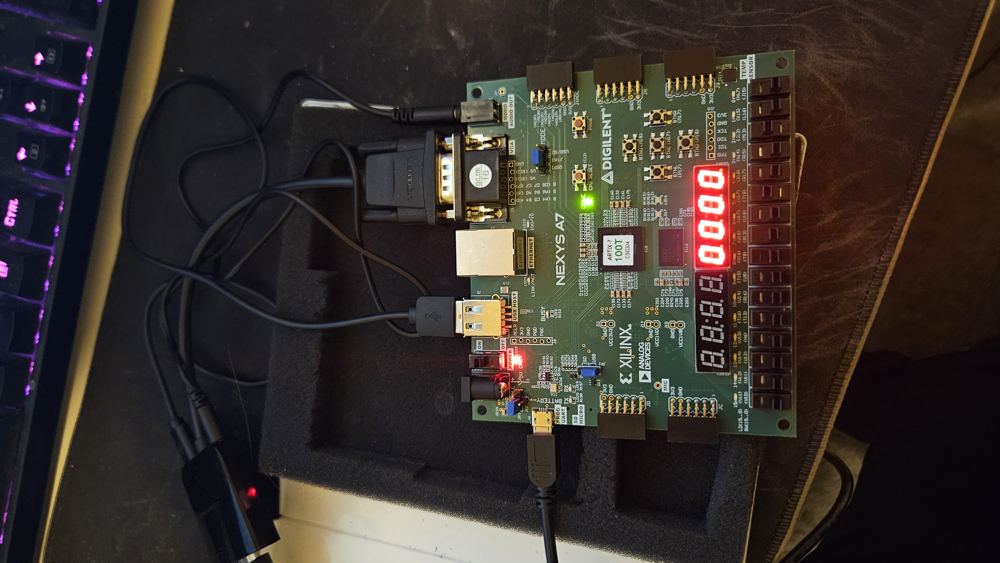
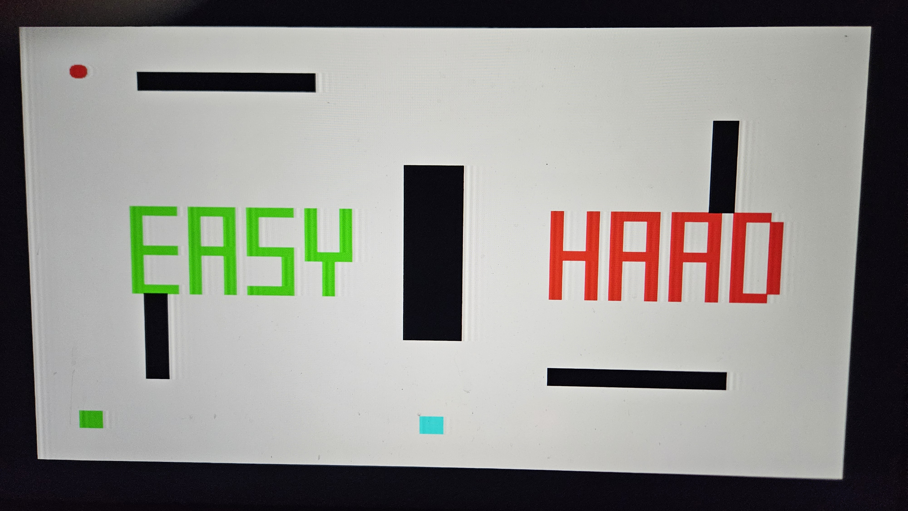
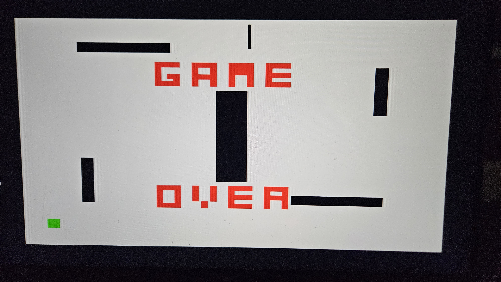
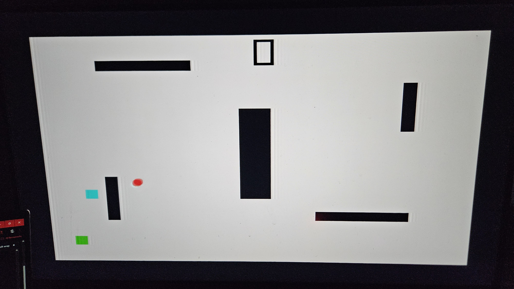

# CPE 487 Final Project: The Stealth Game

## Project Description
**Objective:**
This project transforms the classic "Pong" lab into a top-down **Stealth Survival Game**. Instead of controlling a paddle to hit a ball, the user controls a "Spy" (cyan square) who must navigate a complex, maze-like arena and hide behind obstacles to avoid being caught by the patrolling "Guard" (red square).

**Core Gameplay Loop:**
1.  **The Arena:** The game takes place inside a fortified compound filled with 9 distinct collision objects. This "Maze" forces the player to navigate through narrow choke points while breaking the enemy's line of sight.
2.  **Select Your Fate:** The game features a start menu allowing the player to choose between **Easy Mode** (Slow, lazy guard) and **Hard Mode** (Fast, aggressive guard).
3.  **Survival:** The player must use the 4-directional buttons to evade the Guard. The obstacles provide cover—if the Guard hits a wall, it bounces away, allowing the player to hide on the opposite side.
4.  **Game Over:** If the Guard touches the Spy, the game transitions to a "GAME OVER" death screen.

**High-Level System Architecture:**
The system is built upon the `pong.vhd` top-level entity, which coordinates the VGA timing and game logic modules. The core logic is housed in `bat_n_ball.vhd`, which now includes a complex State Machine (`MENU`, `PLAY_EASY`, `PLAY_HARD`, `GAME_OVER`).

> *Figure 1: High-level block diagram showing the data flow between the Clock Divider, VGA Sync Generator, and the Game Logic (Bat_N_Ball) module.*

## Steps to Run the Project
To reproduce this project on a Nexys A7-100T FPGA board:

1.  **Create Project:** Open Vivado and create a new project targeting the `xc7a100tcsg324-1` part.
2.  **Add Sources:** Import the following VHDL files:
    * `pong.vhd` (Top Level)
    * `bat_n_ball.vhd` (Game Logic, AI, & Rendering)
    * `vga_sync.vhd` (VGA Timing)
    * `clk_wiz_0.vhd` / `clk_wiz_0_clk_wiz.vhd` (Clock Management)
    * `leddec16.vhd` (7-Segment Display Decoder)
3.  **Add Constraints:** Import the `pong.xdc` file. **Crucial:** Ensure the button mappings in the `.xdc` file (`btnU`, `btnD`, `btnL`, `btnR`) match the entity ports in `pong.vhd` exactly.
4.  **Generate Bitstream:** Run Synthesis, Implementation, and Generate Bitstream.
5.  **Program Device:** Connect the Nexys board via USB, open the Hardware Manager, and program the device with the generated `.bit` file.
6.  **Connect Hardware:** Connect a VGA monitor to the VGA port on the Nexys board.

## Inputs and Outputs
**Inputs (Controls):**
* `clk_in`: 100MHz System Clock.
* `btnU`, `btnD`, `btnL`, `btnR`: Controls the Spy's movement and navigates the Menu Selection.
* `btn0` (Center): Serves/Starts the game and resets the game from the Death Screen.

**Outputs (Visuals):**
* `VGA_red`, `VGA_green`, `VGA_blue`: RGB color signals driving the monitor.
* `VGA_hsync`, `VGA_vsync`: Synchronization signals for 60Hz display.
* `SEG7_anode`, `SEG7_seg`: Displays current score on the board.

> *Figure 2: The physical setup showing the FPGA board and button layout.*

## Modifications
This project builds upon the foundational **Lab 6 (Pong)** but introduces substantial changes to satisfy the "Modifications" requirement.

### 1. From 1D Paddle to 2D Player Controller
* **Original:** The bat was constrained to the bottom row (`bat_y` was a constant) and could only move Left/Right.
* **Modification:** We converted `bat_x` and `bat_y` into dynamic signals controlled by a custom process `move_player`.
* **Tuning:** The player speed was increased to **5 pixels/frame** (up from 4) to balance the difficulty against the aggressive new AI.

### 2. Variable Difficulty AI (The Hunter)
* **Original:** The ball moved in a straight line and only changed direction when hitting a wall.
* **Modification:** We implemented a "Hunter" algorithm with two distinct personalities:
    * **Easy Mode:** The Guard moves slower than the player (Speed 3) and has a "lazy" reaction time, only updating its pathfinding every 60 frames (1 second).
    * **Hard Mode:** The Guard moves faster than the player (Speed 6) and has an aggressive reaction time, updating its pathfinding every 20 frames (0.33 seconds).

### 3. Advanced Game States & UI
* **Menu System:** A custom start screen that draws the words "EASY" and "HARD" using block-pixel logic. The text changes color (Red/Green) to indicate selection.

> *Figure 3: The Start Menu. The user selects difficulty using Left/Right buttons. The selected mode turns Green, unselected turns Red.*

* **Death Screen:** When caught, the game freezes and displays "GAME OVER" in large red letters over the center of the arena.
* **On-Screen Score:** A 7-segment style digit is rendered directly onto the VGA output at the top of the screen, mirroring the FPGA board's display.

> *Figure 4: The Death Screen. The game freezes upon capture, displaying the final state and the Game Over message.*

### 4. The Complex Maze Architecture
* **Map System:** We implemented a "Map System" defining **9 distinct collision objects** using AABB (Axis-Aligned Bounding Box) logic.
* **Rendering:** A priority encoding system determines pixel color so that text and game objects render correctly on top of walls: `Text > Obstacle > Enemy > Player > Background`.

> *Figure 5: The main gameplay loop showing the complex arena. Note the Cyan Player hiding behind one of the new vertical pillars (Wall 7) while the Red Guard hunts.*

## Technical Challenges & Solutions

### 1. Collision Physics: Point vs. Area Logic (The "Clipping" Problem)
* **The Difficulty:** In the original Pong lab, the ball was treated as a single coordinate point (center) when checking for wall collisions. In our complex maze with protruding corners (like Walls 7 and 8), a "center-point" check allowed the ball's edges to physically overlap with the wall before the center point hit it. This caused the "Guard" to clip through corners or get stuck inside pillars.
* **The Solution:** We implemented **Axis-Aligned Bounding Box (AABB)** collision logic. Instead of checking if `ball_x = wall_x`, we check if the *entire area* of the ball overlaps with the *entire area* of the wall (e.g., `ball_right > wall_left AND ball_left < wall_right`). This prevents clipping even on thin obstacles.

### 2. The "Painter's Algorithm" in Hardware (Rendering Priority)
* **The Difficulty:** VHDL VGA generation happens in real-time as the electron beam scans the screen. We had multiple objects fighting for the same pixel: The Wall (Black), the Background (White), and the "GAME OVER" Text (Red). Initially, the logic said "If Wall is present, turn off Red." This made the Red text invisible whenever it overlapped a Black wall.
* **The Solution:** We implemented a **Priority Encoder**. We restructured the RGB assignment logic so that `text_on` signals override all other signals.
    * *Logic:* `IF text_on THEN color = Red ELSIF wall_on THEN color = Black ...`

### 3. Human Time vs. Clock Time (Input Sensitivity)
* **The Difficulty:** The VGA loop runs at 60Hz. A human button press typically lasts 100-200ms, which spans 6 to 12 frames. When pressing "Serve" to restart from the Game Over screen, the system would register the press in the *first* frame (transitioning to Menu), but because the finger was still physically on the button in the *second* frame, it would immediately register another press and start the game instantly, skipping the menu selection.
* **The Solution:** We implemented **Edge Detection**. By storing the previous state of the button (`serve_prev`), we changed the trigger condition to `IF serve = '1' AND serve_prev = '0'`. This ensures the action only triggers on the *rising edge* of the signal (the exact moment of the press).

### 4. AI State Management (The "Lazy" vs. "Aggressive" Hunter)
* **The Difficulty:** Creating two distinct AI behaviors without duplicating the entire physics code block.
* **The Solution:** We used **Dynamic Variables** inside the process. Instead of hardcoding speed, we created variables `current_speed` and `ai_reaction_delay` that change values based on the `game_state`.
    * *Hard Mode:* `ai_reaction_delay := 20` (Updates path every 0.33s).
    * *Easy Mode:* `ai_reaction_delay := 60` (Updates path every 1.0s).

## Summary of the Process
* **Corinthian:** Responsible for the **Base Code Architecture** and the **Hard Mode** implementation. Developed the core physics engine, the "Hunter" AI tracking algorithm, and the Game Over logic.
* **Nolan:** Responsible for the **Easy Mode** implementation. Tuned the AI speed and reaction timers to create a balanced difficulty curve for new players.
* **Owusu:** Responsible for the **Level Design**. Designed the complex map layout, defined the coordinate constants for all 9 obstacles, and implemented the priority collision logic that ensures the AI bounces off walls while hunting.
